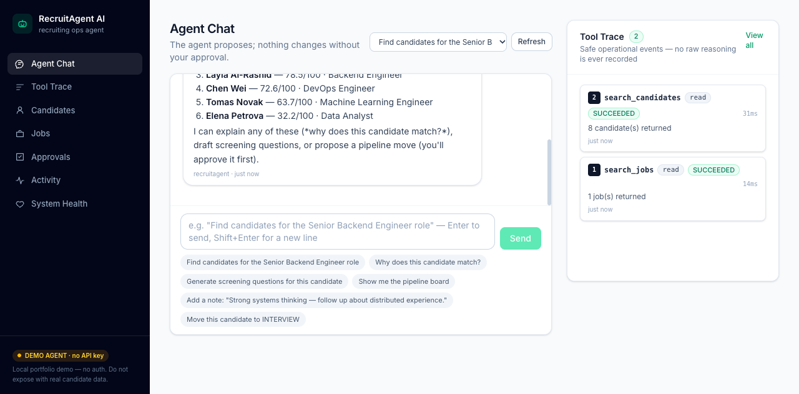
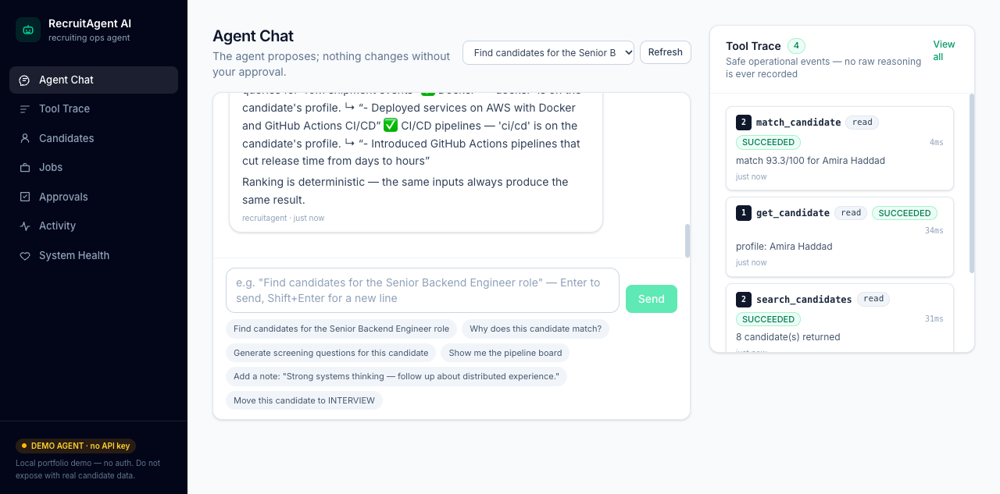
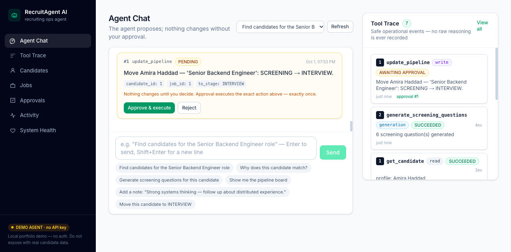
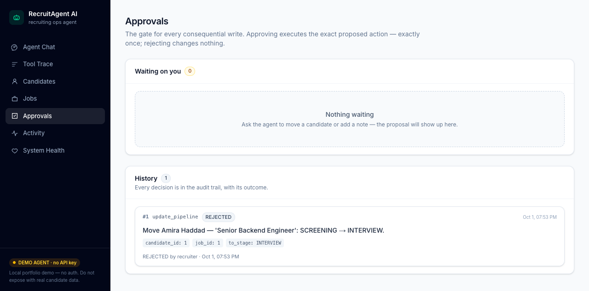
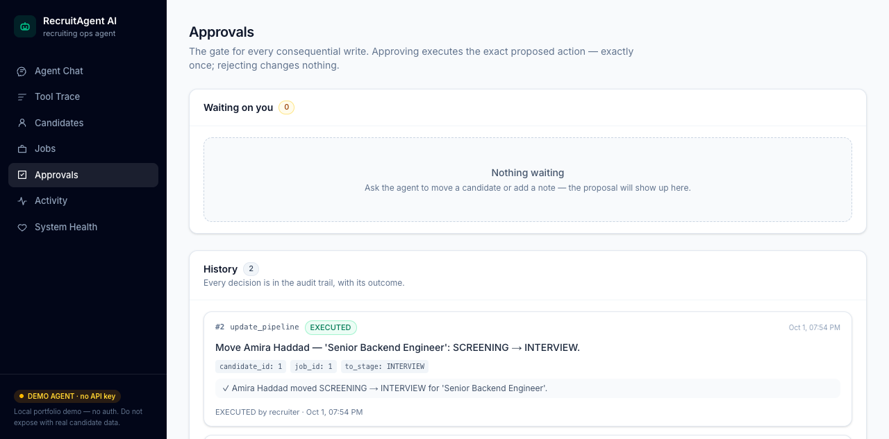
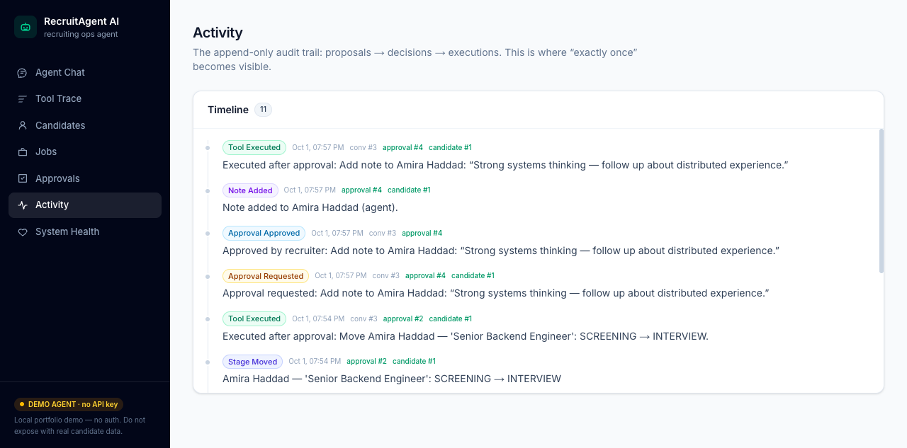
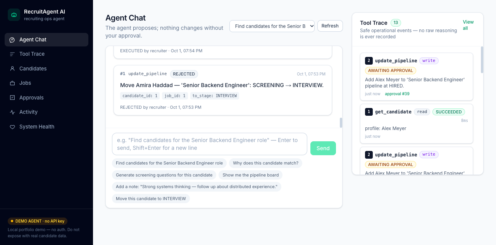
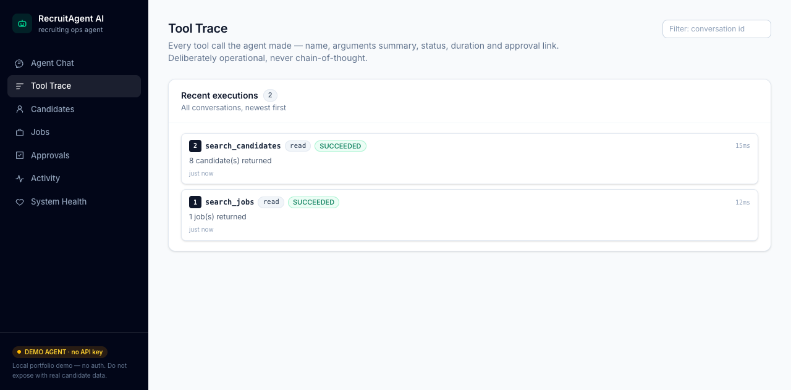
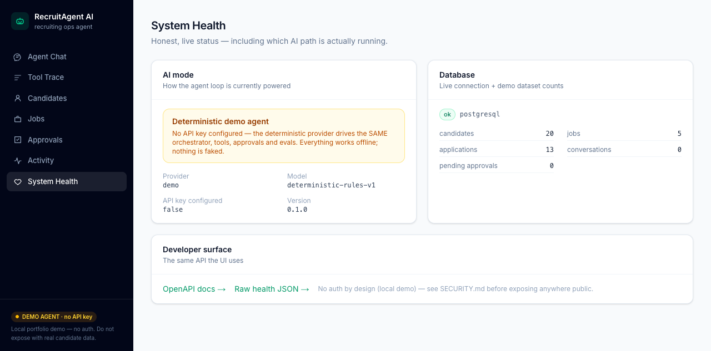

# RecruitAgent AI

**An open-source recruiting operations agent with human-in-the-loop control.**
The agent reads, explains and proposes. Humans decide. Every consequential action passes through a backend-enforced approval with exactly-once execution — and the whole product works with **no API key**.

```bash
git clone https://github.com/Nihal-MN/recruitagent-ai.git   # or Code → Download ZIP
cd recruitagent-ai
cp .env.example .env
docker compose up --build -d
docker compose exec api python -m app.seed               # one-time demo data
# open http://localhost:3000
```

That gives you the full system — agent chat, live tool trace, candidate & job workspaces, approvals, activity audit and health — running against a synthetic dataset (20 fictional candidates, 5 roles). Nothing else to install, nothing to configure, no key required.

> ⚠️ **Local demo, no auth by design.** Never point it at real candidate data or expose it publicly — see [SECURITY.md](SECURITY.md). The staged migration path to production posture is in [ROADMAP.md](ROADMAP.md).

---

## Why this exists

AI recruiting tools usually fail in one of two ways: they either answer from thin air, or they quietly *do* things — moving candidates, writing notes — with no accountable human in the loop. RecruitAgent is built around the opposite bet:

- **Grounded or nothing.** Every claim about a candidate comes from a tool result, traceable to the stored profile. The agent has no ability to mutate data by talking about it.
- **Ops actions require approval.** Moving a candidate or writing a note creates a *proposal*; execution happens only after a human approves it, exactly once.
- **Untrusted content stays data.** Resumes, JDs and notes can contain anything — including instructions aimed at the model. They are treated as data, never as commands.
- **No protected characteristics. Ever.** Matching uses skills, experience and domain evidence only; the schema itself stores nothing else, and a test enforces that.

## Screenshots

| Agent chat with live tool trace | Explainable match, evidence-quoted | The approval gate |
|---|---|---|
|  |  |  |

| Reject → zero mutation | Approve → executed exactly once | Append-only activity audit |
|---|---|---|
|  |  |  |

| Hostile resume instruction — still gated | Tool trace (no chain-of-thought) | System health — honest AI mode |
|---|---|---|
|  |  |  |

More: [candidates](docs/screenshots/15_candidates.png) · [candidate detail with evidence](docs/screenshots/16_candidate_detail.png) · [jobs](docs/screenshots/17_jobs.png) · [job requirements](docs/screenshots/18_job_detail.png) · [screening questions](docs/screenshots/05_screening_questions.png) · [note workflow](docs/screenshots/10_note_approval.png).

## What you can do in the demo

| Ask the agent | What happens |
|---|---|
| *"Find candidates for the Senior Backend Engineer role"* | searches jobs → ranks candidates with deterministic explainable matching |
| *"Why does this candidate match?"* | full requirement-by-requirement breakdown with quoted evidence |
| *"Generate screening questions"* | job-related questions grounded in the match (never personal/protected topics) |
| *"Add a note: …"* / *"Move this candidate to INTERVIEW"* | creates a **pending approval** — nothing changes until you approve it |
| *"Show me the pipeline board"* | stage-by-stage view of every application |

Plus the surrounding workspace: the **Tool Trace** page shows every tool call (name, sanitized arguments, status, duration, approval link) — operational events only, never chain-of-thought. The **Approvals** page is where proposals become decisions. The **Activity** page is the append-only audit trail.

## How it works

```
Next.js UI ── HTTP ──► FastAPI ──► Orchestrator (bounded loop)
                          │              ├── Provider (demo agent | OpenAI tool calling)
                          │              ├── Tool Registry (10 tools, strict schemas)
                          │              ├── Policy: writes → ApprovalRequest (no execution)
                          │              └── Tool Trace + Activity audit
                          └──► PostgreSQL (candidates, jobs, pipeline, conversations, approvals)
```

- **10 tools** — 6 reads, 2 generations, 2 controlled writes — each with a strict Pydantic input/output contract. The agent cannot call anything else.
- **A real bounded loop** — max steps and max tool calls, validation, structured error observations, no invented entities.
- **Two interchangeable providers** — a deterministic demo agent (keyless, powers the demo and the entire eval suite) and OpenAI tool calling (`AI_PROVIDER=auto` with a key). Same orchestrator, same guarantees.
- **MCP server** — the same read tools plus a proposal-only write, for external clients via `python -m app.mcp_server`.

More detail: [ARCHITECTURE.md](docs/ARCHITECTURE.md) · [AGENT_DESIGN.md](docs/AGENT_DESIGN.md) · [TOOLS.md](docs/TOOLS.md) · [MCP.md](docs/MCP.md).

## Testing & evals

```bash
make test            # backend: 74 hermetic tests incl. the eval suite and an MCP stdio smoke test
make test-frontend   # frontend: unit tests
```

The behavioral suite (**docs/EVALUATIONS.md**) covers 23 named scenarios (the 22 planned behaviors plus a regression uncovered during browser acceptance) — grounding, tool selection, nonexistent/ambiguous entities, malformed arguments, unknown tools, step bounds, approval flows (reject = no mutation, approve = exactly once, replay = no-op), prompt injection through resumes/JDs/notes, and protected-characteristic refusals. It runs against the deterministic provider, in CI, with no network and no key.

## Using a real model (optional)

```bash
cp .env.example .env
# set OPENAI_API_KEY=... and AI_PROVIDER=auto (the default)
docker compose up --build -d
```

The OpenAI provider (Responses API function tools + structured outputs) then plans the turns. Approvals, validation, tracing and limits are unchanged — they live in the orchestrator, not the prompt. If the key is absent, everything keeps working on the demo provider; `/health` always reports which path is active.

## Project layout

```
backend/    FastAPI app, orchestrator, tools, providers, approvals, alembic, seed, tests
frontend/   Next.js console (chat, trace, candidates, jobs, approvals, activity, health)
docs/       architecture, agent design, tools, MCP, evals, security, interview guide, ADRs
```

## Status & honesty notes

- Solo portfolio project (v0.1.0). It demonstrates agent engineering with real controls — it is **not** production recruiting software and there is no signup/auth layer yet.
- The OpenAI provider is implemented against the current SDK and stub-tested in CI; it is not exercised against a live key here — `/health` tells you which provider ran.
- Demo data is synthetic (`@example.com`, 555-numbers, invented names). No real candidate data ships with the repo.

## License

MIT — see [LICENSE](LICENSE).
